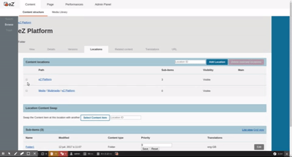

# How-to: Add activable element in a selection form

The Hybrid Platform UI application provides a custom element called `ez-selection-activate-element`. This component gives the possibility to easily implement activable
elements (like buttons) that will be enabled and can triggers actions only if some elements in a
list are selected.
The selection is done with the help of checkboxes or radio buttons. Some activable elements
need at least one or more element checked to be enabled, but others will need one and only one
element checked to be enabled.



## Markup convention

### Basic usage

The activable elements inside this tag should contains the `ez-js-activable-element` class.

Example :

```html
<ez-selection-activate-element>
    <ul>
        <li><input type="checkbox"></li>
    </ul>
    <button class="ez-js-activable-element" disabled>Do!</button>
</ez-selection-activate-element>
```
In this example, checking the checkbox will enable the button with the `ez-js-activable-element`
class. Unchecking the checkbox will disable the button back.

### Single element selection

The activable element can be configured to be enabled by a single selection only (which means a
multiple will disable it). To have this behavior, the activable element needs the
`ez-js-activable-element-single-selection` class.

Example:

```html
<ez-selection-activate-element>
    <ul>
        <li><input type="checkbox"></li>
        <li><input type="checkbox"></li>
    </ul>
    <button class="ez-js-activable-element ez-js-activable-element-single-selection" disabled>Do!</button>
</ez-selection-activate-element>
```

In this example, only one checkbox should be checked to activate the button.

### Enable a button based on a subset of specific checkboxes

The activable element can also be configured to be enable only by a specific subset of checkboxes.
To do that `<ez-selection-activate-element>` should have a `selection-selector` attribute. And the
specific checkboxes should have a class that matches this selector.

Example:

```html
<ez-selection-activate-element selection-selector=".checkboxes-that-matches">
    <ul>
        <li><input type="checkbox" class="this-checkbox-will-not-match"></li>
        <li><input type="checkbox" class="checkboxes-that-matches"></li>
    </ul>
    <!-- ... -->
    <button class="ez-js-activable-element" disabled>Do!</button>
</ez-selection-activate-element>
```
In this example, only the checkbox with `checkboxes-that-matches` will enable the button.
